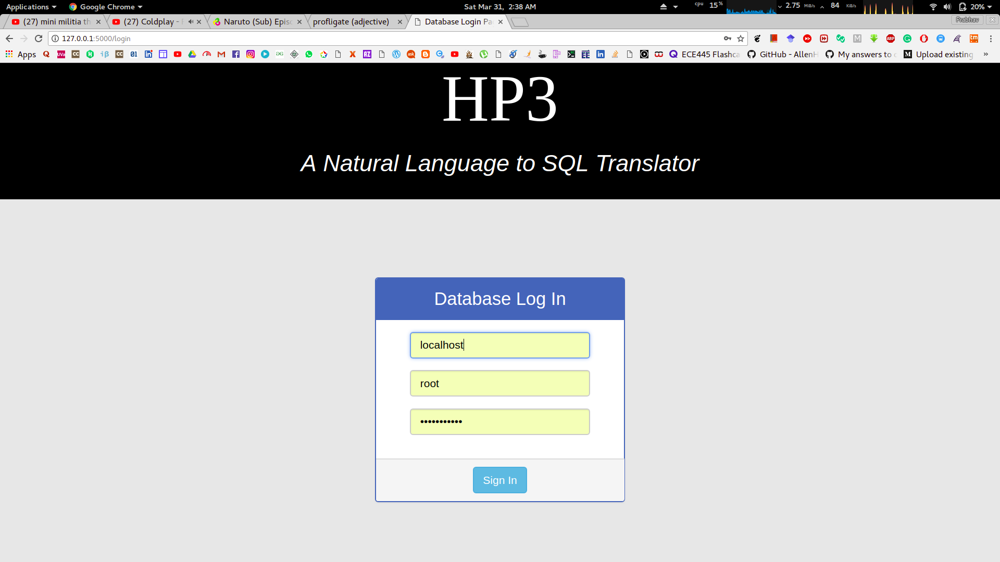
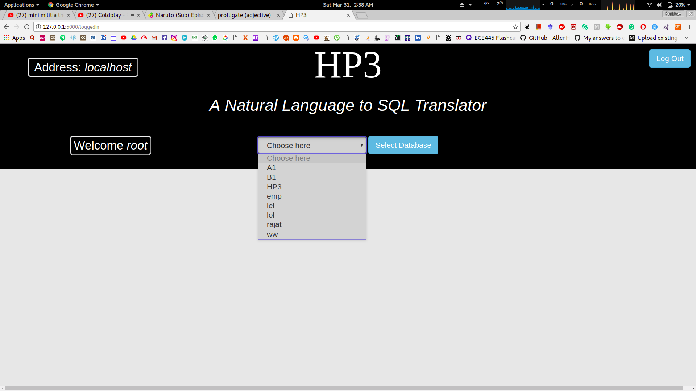
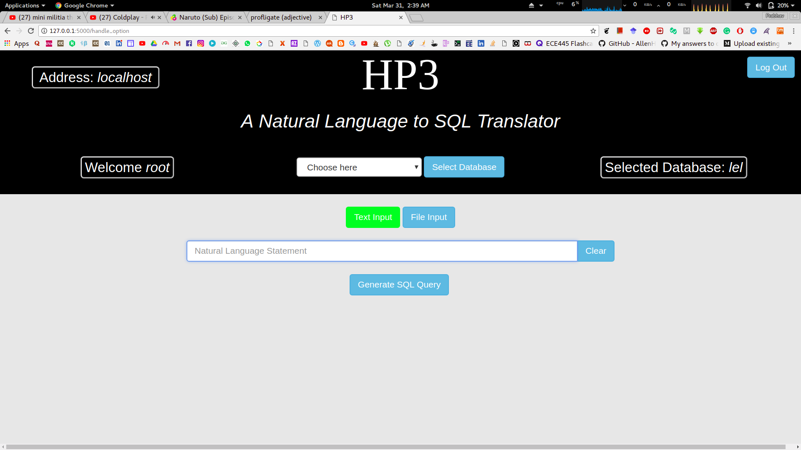
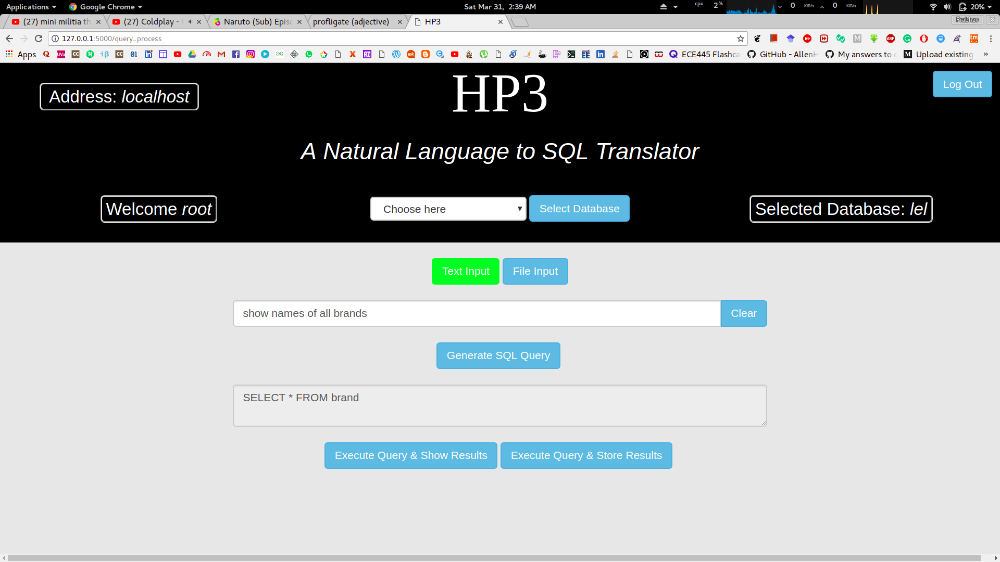
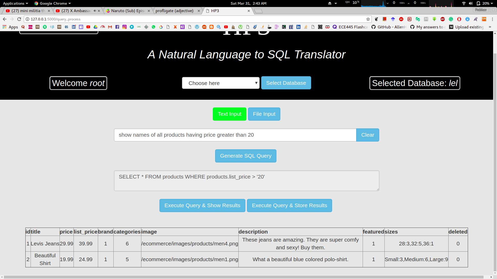
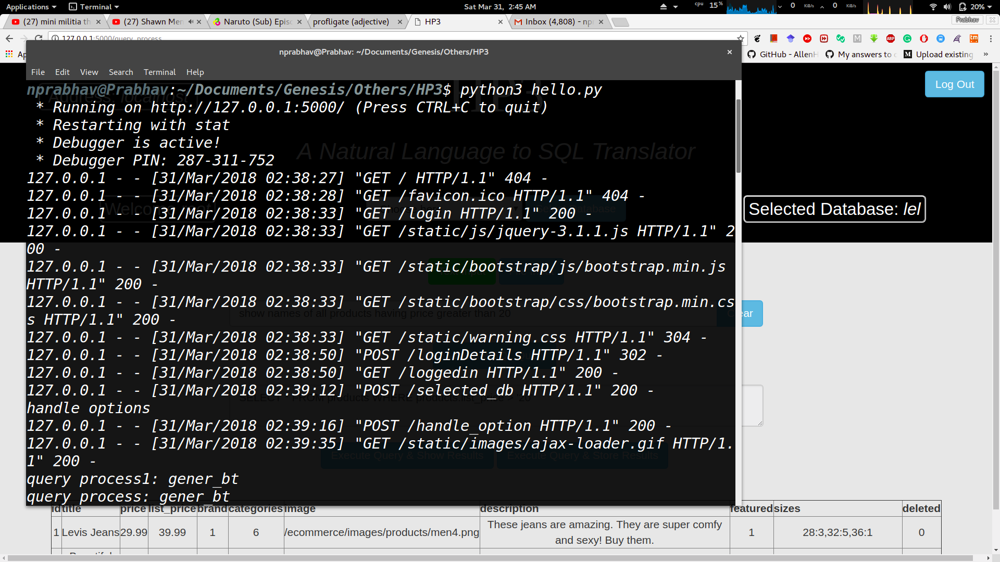
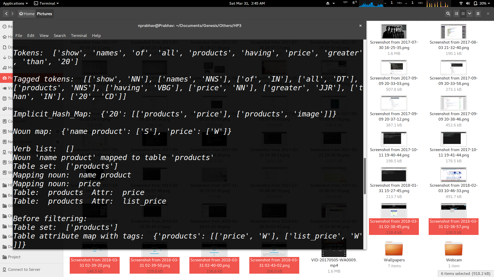
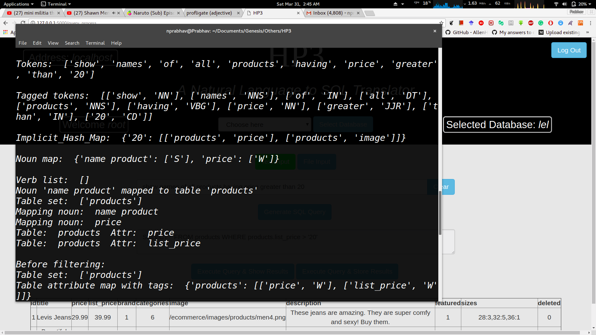
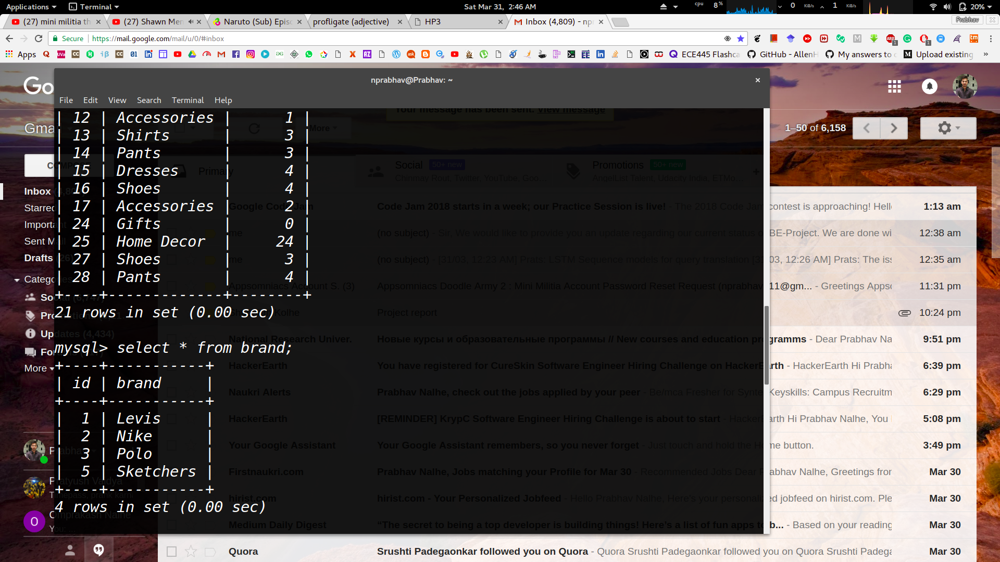

# HP3 - A tool for conversion of Natural Language to SQL
[](http://forthebadge.com)  [](http://forthebadge.com)

[](https://opensource.org/licenses/mit-license.php)
[](http://makeapullrequest.com)

> Natural Language to SQL Converter


An attempt at creating a system which converts english query to SQL and display results after executing. Made in
python. [Live Website](http://nprabhav.pythonanywhere.com/).

Deployed here :(http://nprabhav.pythonanywhere.com/)


## Usage

```sh
bash run.sh
```
You don't need to really install anything. `run.sh` takes care of everything. Really.

## Tools and Technologies Used
* **Flask**
* **Nltk**
* **Python3**
* **Pymysql**
* **Xlsxwriter**
* **Standford POS Tagger**
* **MySQL DB**

## Description
A software which converts Natural language statements to SQL queries

An intelligent system is designed between the user and the database system which accepts natural language input and then converts it into an SQL query. The research focuses on incorporating complex queries along with simple queries irrespective of the database. The system accommodates aggregate functions, multiple conditions in WHERE clause, advanced clauses like ORDER_BY, GROUP_BY and HAVING. The system handles single sentence natural language inputs, which are with respect to selected database. The research currently concentrates on MySQL database system.
The natural language statement goes through various stages of Natural Language Processing like morphological, lexical, syntactic and semantic analysis resulting in SQL query formation.


## Convenient screenshot
* Output













## Contributing

Your contributions are always welcome :smile: ! Please have a look at the [contribution guidelines](CONTRIBUTING.md) first.

Before working on an issue / feature, it is **crucial** that you're assigned the task on a GitHub issue.
* If a relevant issue already exists, discuss on the issue and get yourself assigned on GitHub.
* If no relevant issue exists, open a new issue and get it assigned to yourself on GitHub.
Please proceed with a Pull Request only after you're assigned. It'd be a waste of your time as well as ours if you have not contacted us before hand when working on some feature / issue.

## People involved
* [Prabhav Nalhe](https://github.com/nprabhav)
* [Pratyush Vaidya]
* [Hrishikesh Tele]
* [Maroti Sorgekar]

## Goals
* User-friendly interface: To create an user-friendly interface for providing input query to the system.
* Pre-processing of given query: To perform analysis(tokenization, NER(Named Entity Recognition) etc. on given query.
* Analysis of given query: To find an appropriate mapping from a MySQL query dictionary using classification algorithms.
* Execution of Query: To form, execute the required MySQL query and obtain its result-set.  	
* Displaying Output : Display the obtained result set in form of tables, graphs etc.

## The Why
Most of the IT applications require storing and retrieving information from databases. The
data retrieval requires the knowledge of database languages like MySQL. The user submits a
query as text through the user interface and gets the result of the query in the text format
using Natural Language Processing. Hence the aim of our project is to enable communication
between people and computers without resorting to memorization of queries and procedures.
Natural Language Processing techniques are applied on English text query to generate
MySQL query (DML queries) on E-Commerce database. This translation uses lexical
analyzer, parser and syntax directed translation technique. This system could handle basic
queries asked by the user in the form of text. Adding a data dictionary like Thesaurus is
another suggestion, which could help automating the synonymous words during the semantic
analysis.

## License
The MIT License (MIT) 2018 - [Prabhav Nalhe](https://github.com/nprabhav).
Please have a look at the [LICENSE](LICENSE) for more details.


